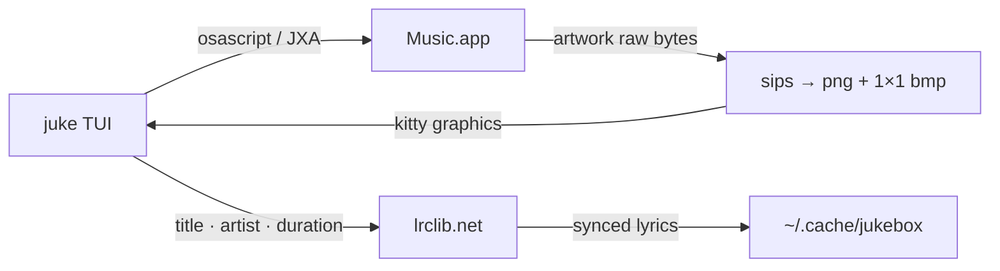

```
      ██╗██╗   ██╗██╗  ██╗███████╗██████╗  ██████╗ ██╗  ██╗
      ██║██║   ██║██║ ██╔╝██╔════╝██╔══██╗██╔═══██╗╚██╗██╔╝
      ██║██║   ██║█████╔╝ █████╗  ██████╔╝██║   ██║ ╚███╔╝
 ██   ██║██║   ██║██╔═██╗ ██╔══╝  ██╔══██╗██║   ██║ ██╔██╗
 ╚█████╔╝╚██████╔╝██║  ██╗███████╗██████╔╝╚██████╔╝██╔╝ ██╗
  ╚════╝  ╚═════╝ ╚═╝  ╚═╝╚══════╝╚═════╝  ╚═════╝ ╚═╝  ╚═╝
```
<div align="center">

### `YOUR APPLE MUSIC LIBRARY // IN THE TERMINAL`

*a three-panel jukebox for Music.app — album art in real pixels, a queue Apple wouldn't give us, zero frameworks*

   -ff9f0a?style=flat-square&labelColor=111111) 

</div>

---

## 📻 What is this

Apple Music has no real terminal client — the existing TUIs either target other streaming services or fight Music.app and lose. jukebox doesn't fight it. Music.app keeps doing the playing (its library is DRM'd, nothing else *can* play it), and jukebox becomes the remote control: a lazygit-style three-panel TUI that talks to Music over `osascript`, renders the album cover as actual pixels through the Kitty graphics protocol, and pulls time-synced lyrics from lrclib.net.

The whole library loads in one bulk fetch at startup (~0.2s for ~1700 tracks), so browsing and filtering never talk to Music.app while you type. The queue deserves a footnote: Apple never exposed Up Next to scripting, so jukebox maintains its own through a scratch playlist it rebuilds on every edit — reverse-engineering around Music.app's snapshot behavior, stale reads, and dropped volume events is where most of the git history went.

One file, no runtime dependencies, inherits your terminal theme. The only full-color element on screen is the cover art, which is how a music player should dress.

```console
nick@jukebox:~$ juke play "not like us"
▶ Not Like Us — Kendrick Lamar
[✓] music.app does the playing. we just look good pointing at it.
```

## 🎛 The panels

| | feature | what it actually does |
|---|---|---|
| 01 | **player panel** | what it actually shows: cover art as real pixels (kitty graphics, quadrant-free), progress bar tinted with the cover's dominant color, genre · year · plays · ♥, and up next |
| 02 | **browser** | songs / albums / playlists / artists tabs (`1-4`), newest first, `/` filters locally and instantly — one bulk fetch at startup, zero apple events per keystroke |
| 03 | **preview** | lazygit's signature move — hover an album, playlist, or artist and see inside before committing. `l` drills in, enter plays from that exact track |
| 04 | **queue** | `a` adds the hovered thing, the queue view (`⇥`) has its own cursor: enter jumps, `x` removes, `J/K` reorder — all via a scratch playlist, because apple's real up next is scripting-proof |
| 05 | **lyrics** | time-synced from lrclib.net (keyless), current line highlighted and auto-scrolled, cached in `~/.cache/jukebox` — music.app never shares its own |
| 06 | **quick commands** | `juke play/queue/album/artist/playlist/search` with fzf picking (multi-select for queue) — the extras, for when the TUI is overkill |

## 🚀 Run it

You need macOS, [Bun](https://bun.sh), Music.app with a library in it, and a terminal that speaks the Kitty graphics protocol (Ghostty, kitty, WezTerm). `fzf` is optional but makes the CLI pickers fuzzy.

```bash
git clone https://github.com/nitrimandylis/jukebox.git
cd jukebox
bun run compile   # → ~/.bun/bin/juke, and man juke into your manpath
juke
man juke          # the full command + TUI-key reference, offline
```

First run, macOS will ask whether the terminal may control Music. Say yes — that permission *is* the architecture.

## 🔩 Under the hood



| layer | path | job |
|---|---|---|
| everything | `jukebox.ts` | the TUI, the commands, the Music.app diplomacy — one file, raw escape codes, no TUI framework |
| checks | `jukebox.test.ts` | the pure logic (time, wrapping, grouping, LRC parsing) — `bun test` |
| product notes | `PRODUCT.md` | what this is and the Music.app scripting landmines, documented so nobody steps on them twice |
| cache | `~/.cache/jukebox` | covers, accent pixels, lyrics — regenerable, survives reboots |

**Stack:** Bun · TypeScript · osascript (JXA + AppleScript) · sips · Kitty graphics protocol · lrclib.net

---

<div align="center">

**[Nick Trimandylis](https://github.com/nitrimandylis)**

`APPLE WOULDN'T SHARE THE QUEUE SO WE BUILT OUR OWN`

MIT licensed.

</div>
