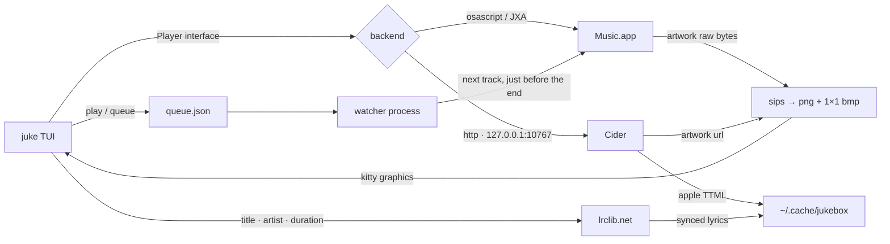

```
      ██╗██╗   ██╗██╗  ██╗███████╗██████╗  ██████╗ ██╗  ██╗
      ██║██║   ██║██║ ██╔╝██╔════╝██╔══██╗██╔═══██╗╚██╗██╔╝
      ██║██║   ██║█████╔╝ █████╗  ██████╔╝██║   ██║ ╚███╔╝
 ██   ██║██║   ██║██╔═██╗ ██╔══╝  ██╔══██╗██║   ██║ ██╔██╗
 ╚█████╔╝╚██████╔╝██║  ██╗███████╗██████╔╝╚██████╔╝██╔╝ ██╗
  ╚════╝  ╚═════╝ ╚═╝  ╚═╝╚══════╝╚═════╝  ╚═════╝ ╚═╝  ╚═╝
```
<div align="center">

### `YOUR APPLE MUSIC LIBRARY // IN THE TERMINAL`

*a three-panel jukebox for Music.app and Cider — album art in real pixels, a queue Apple wouldn't give us, zero frameworks*

    

</div>

---

## 📻 What is this

Apple Music has no real terminal client — the existing TUIs either target other streaming services or fight Music.app and lose. jukebox doesn't fight it. Music.app keeps doing the playing (its library is DRM'd, nothing else *can* play it), and jukebox becomes the remote control: a lazygit-style three-panel TUI that talks to Music over `osascript`, renders the album cover as actual pixels through the Kitty graphics protocol, and pulls time-synced lyrics from lrclib.net.

The whole library loads in one bulk fetch at startup (~0.2s for ~1700 tracks), so browsing and filtering never talk to Music.app while you type. The queue deserves a footnote: Apple never exposed Up Next to scripting, so jukebox maintains its own — a queue file on disk plus a small detached watcher process that starts the next track just before the current one ends. No scratch playlists cluttering Music.app (or syncing to your phone), and queue edits are just file writes.

If you run [Cider](https://cider.sh) instead, jukebox drives that: same three panels, same keys, but over Cider's local HTTP API rather than osascript. Cider has a real queue, so the queue file and the watcher sit the round out, and lyrics come from Apple's own time-synced TTML. Set `JUKEBOX_CIDER_TOKEN` (Cider → Settings → Connectivity → External Application API) and jukebox picks Cider whenever it's running, Music.app whenever it isn't. No token, no probe, no cost.

The trade is startup: Music.app hands over the whole library in one bulk fetch, where Cider needs ~3s of paged HTTP for 1891 songs. So the player panel goes live immediately and the browser says `loading library…` until it lands.

One file, no runtime dependencies, inherits your terminal theme. The only full-color element on screen is the cover art, which is how a music player should dress.

```console
nick@jukebox:~$ juke play "not like us"
▶ Not Like Us — Kendrick Lamar
[✓] music.app does the playing. we just look good pointing at it.
```

## 🎛 The panels

| | feature | what it actually does |
|---|---|---|
| 01 | **player panel** | what it actually shows: cover art as real pixels (kitty graphics, quadrant-free), progress bar tinted with the cover's dominant color, genre · year · plays · ♥, and up next |
| 02 | **browser** | songs / albums / playlists / artists tabs (`1-4`), newest first, `/` filters locally and instantly — one bulk fetch at startup, zero apple events per keystroke |
| 03 | **preview** | lazygit's signature move — hover an album, playlist, or artist and see inside before committing. `l` drills in, enter plays from that exact track |
| 04 | **queue** | `a` adds the hovered thing, the queue view (`⇥`) has its own cursor: enter jumps, `x` removes, `J/K` reorder — all plain file edits, because apple's real up next is scripting-proof |
| 05 | **lyrics** | time-synced — apple's own TTML on cider, lrclib.net (keyless) on music.app, which never shares its own. current line highlighted and auto-scrolled, cached in `~/.cache/jukebox` |
| 06 | **quick commands** | `juke play/queue/album/artist/playlist/search` with fzf picking (multi-select for queue) — the extras, for when the TUI is overkill |

## 🚀 Run it

You need macOS, [Bun](https://bun.sh), Music.app (or Cider) with a library in it, and a terminal that speaks the Kitty graphics protocol (Ghostty, kitty, WezTerm). `fzf` is optional but makes the CLI pickers fuzzy.

```bash
git clone https://github.com/nitrimandylis/jukebox.git
cd jukebox
bun run compile   # → ~/.bun/bin/juke, man juke, and the agent skill
juke
man juke          # the full command + TUI-key reference, offline
```

First run, macOS will ask whether the terminal may control Music. Say yes — that permission *is* the architecture.

For the Cider backend, mint a token in Cider → Settings → Connectivity → External Application API and export it:

```bash
export JUKEBOX_CIDER_TOKEN=…      # cider when it's running, music.app when it isn't
export JUKEBOX_PLAYER=cider       # optional: pin the backend (cider | music)
```

## 🤖 The agent skill

`juke-cli/SKILL.md` is an agent skill for driving `juke` — which commands run unattended (`pause`, `next`, `search`) and which open an fzf picker that only a human can answer, plus how the Music.app queue and its watcher actually behave. The traps that don't fit in
`--help`, in other words. `bun run compile` copies it into `~/.claude/skills/`.

It's a plain directory at the repo root rather than a `.claude/` one, because this repo is public and
not everyone drives it with the same agent. Point yours at the file.

## 🔩 Under the hood


```mermaid
flowchart LR
    A[juke TUI] -->|Player interface| P{backend}
    P -->|osascript / JXA| B[Music.app]
    P -->|http · 127.0.0.1:10767| H[Cider]
    B -->|artwork raw bytes| C[sips → png + 1×1 bmp]
    H -->|artwork url| C
    C -->|kitty graphics| A
    A -->|title · artist · duration| D[lrclib.net]
    H -->|apple TTML| E[~/.cache/jukebox]
    D -->|synced lyrics| E
    A -->|play / queue| F[queue.json]
    F --> G[watcher process]
    G -->|next track, just before the end| B
```

| layer | path | job |
|---|---|---|
| everything | `jukebox.ts` | the TUI, the commands, the Music.app diplomacy and the Cider client — one file, raw escape codes, no TUI framework |
| the backends | `Player` in `jukebox.ts` | one interface, two implementations; the TUI never learns which one it got |
| the queue | `~/.cache/jukebox/queue.json` | **music.app only** — what plays next, as JSON. every edit is a file write, nothing touches Music.app. cider has a real queue, so this file goes unused |
| the watcher | `juke watch` (spawned for you) | **music.app only** — a detached loop that polls Music and starts the next queued track just before the current one ends. exits when the queue does, or when you take over |
| checks | `jukebox.test.ts` | the pure logic (time, wrapping, grouping, LRC + TTML parsing, queue edits, backend choice) — `bun test` |
| product notes | `PRODUCT.md` | what this is and the Music.app scripting landmines, documented so nobody steps on them twice |
| cache | `~/.cache/jukebox` | covers, accent pixels, lyrics — regenerable, survives reboots |

**Stack:** Bun · TypeScript · osascript (JXA + AppleScript) · Cider's local API · sips · Kitty graphics protocol · lrclib.net

---

<div align="center">

**[Nick Trimandylis](https://github.com/nitrimandylis)**

`APPLE WOULDN'T SHARE THE QUEUE SO WE BUILT OUR OWN`

MIT licensed.

</div>
